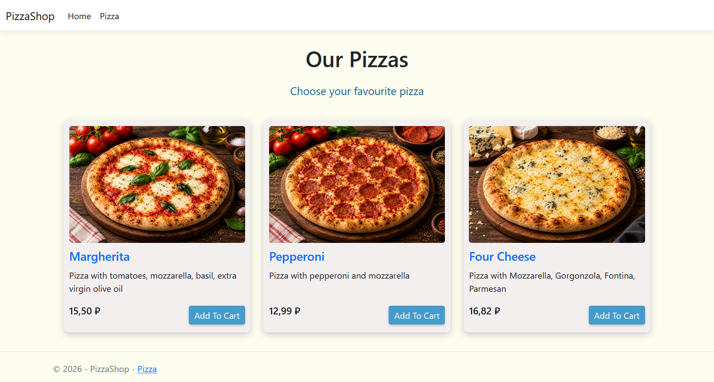
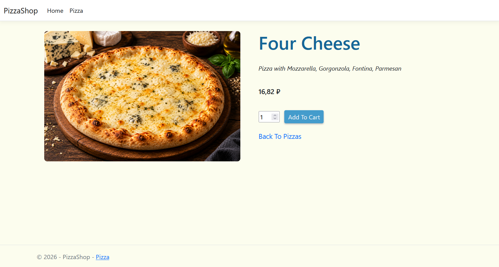
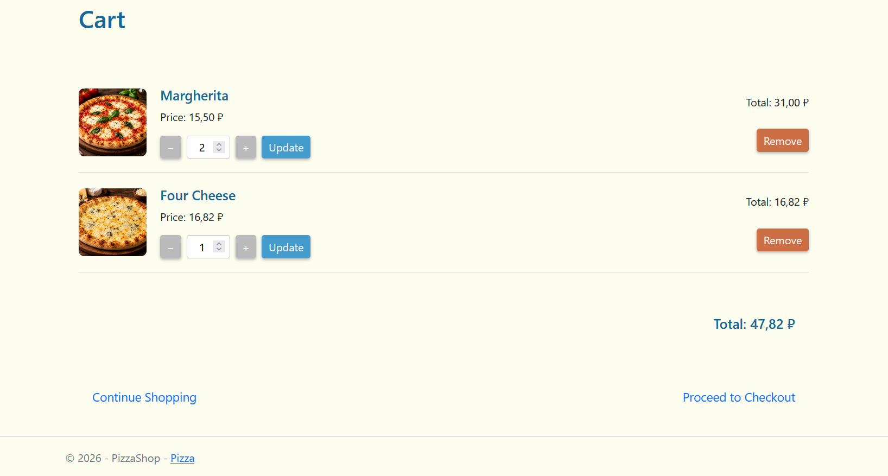
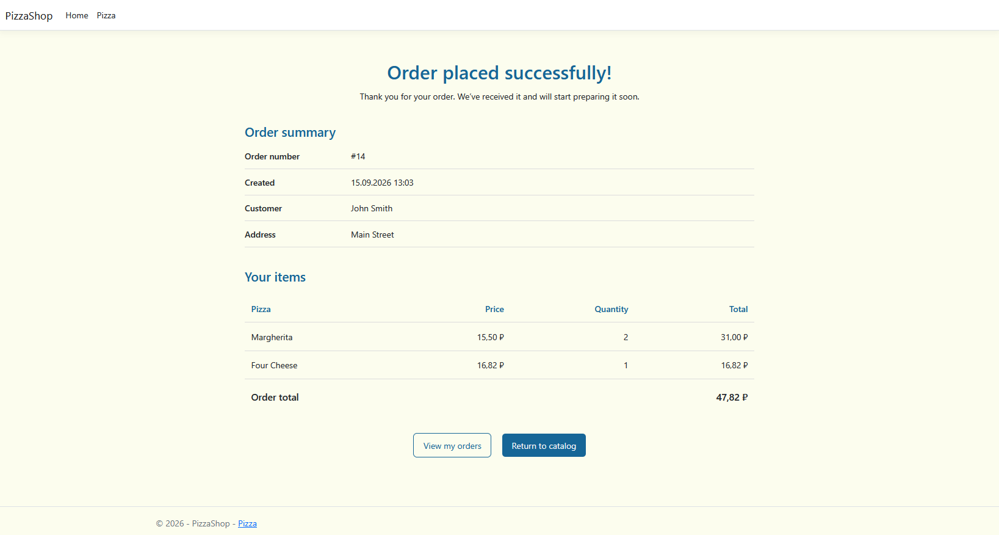
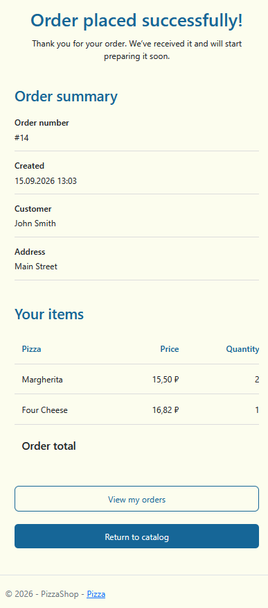

# PizzaShop

Небольшой интернет-магазин пиццы, разработанный на ASP.NET Core MVC.
Проект демонстрирует реализацию полного пользовательского сценария: просмотр каталога, просмотр деталей товара, добавление товаров в корзину, оформление заказа и просмотр истории заказов.

## Preview

## Features

* Просмотр каталога пицц
* Страница деталей пиццы
* Добавление товаров в корзину
* Изменение количества и удаление товаров
* Хранение корзины в Session
* Оформление заказа с валидацией формы
* Сохранение заказов в базе данных
* Просмотр созданного заказа
* История заказов и страницы деталей заказа
* Снимок названия и цены товара на момент оформления заказа
* Обработка отсутствующих товаров и некорректных данных
* Адаптивный интерфейс

## Tech Stack
* C#
* ASP.NET Core MVC
* Entity Framework Core
* SQLite database
* Razor Views
* Session
* Data Annotations
* HTML / CSS
* xUnit

## Architecture

Проект использует разделение ответственности между слоями:

Controller -> Service -> DbContext -> Database

## How to Run

1. Клонируйте репозиторий.
2. Откройте решение в Visual Studio или Rider.
3. Запустите приложение.

## Screenshots

### Catalog

### Pizza Details

### Cart

### Order

### Order (mobile version)

 

## Possible Improvements

* Авторизация пользователей
* Раздел администратора
* Управление каталогом
* Интеграция оплаты
* Более подробное покрытие тестами
* Улучшение обработки ошибок и логирования
* Разделение истории заказов по пользователям
